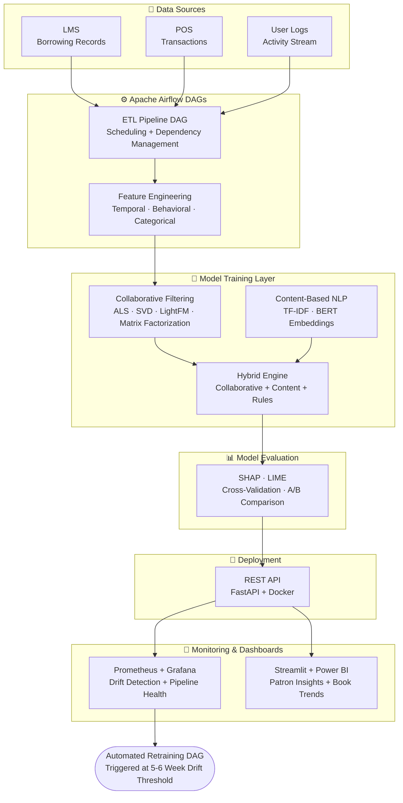

# 📚 Smart Library ML Platform

> End-to-end machine learning platform for library patron analytics and book 
> recommendation — built on real production work at Symplore. Covers the full 
> ML lifecycle: multi-source data ingestion, feature engineering, hybrid 
> recommendation engine (ALS + BERT + rules), Airflow ETL orchestration, 
> REST API deployment, and Prometheus/Grafana drift monitoring.

## 🚧 Status: In Development | Expected: July 2026

---

## The Problem
Library management systems collect data from multiple sources — LMS borrowing 
records, POS transactions, user activity logs — but rarely connect them into 
a unified model. This platform ingests all three, engineers behavioral and 
temporal features, and serves personalized recommendations via a production API.

---

## Architecture

## What This Demonstrates
- **Full ML Lifecycle**: Raw ingestion → feature engineering → model training → 
  evaluation → deployment → monitoring → retraining
- **Hybrid Recommender Systems**: Collaborative (ALS, SVD, LightFM) + 
  Content-based (TF-IDF, BERT) + rule layer combined into a single engine
- **Pipeline Orchestration**: Apache Airflow DAGs for ETL scheduling and 
  dependency management
- **Real-time Ingestion**: Kafka-based streaming for live user activity
- **MLOps**: Docker deployment, Prometheus/Grafana drift monitoring, automated 
  retraining triggers at the 5–6 week decay threshold
- **Explainability**: SHAP and LIME for model decision transparency

---

## Model Comparison
*(Will be populated on completion)*

| Model | Precision@10 | Recall@10 | NDCG@10 | Training Time |
|---|---|---|---|---|
| Popularity Baseline | TBD | TBD | TBD | TBD |
| Collaborative (ALS) | TBD | TBD | TBD | TBD |
| Content-Based (BERT) | TBD | TBD | TBD | TBD |
| **Hybrid Engine** | TBD | TBD | TBD | TBD |

---

## Tech Stack
`Python` `Apache Airflow` `Kafka` `LightFM` `Scikit-learn` 
`BERT` `FastAPI` `Docker` `Prometheus` `Grafana` `Streamlit` 
`Power BI` `PostgreSQL` `SHAP` `LIME`

---

## Repo Structure (In Progress)
smart-library-ml-platform/
├── ingestion/
│   ├── lms_connector.py      # LMS borrowing records pipeline
│   ├── pos_connector.py      # POS transaction ingestion
│   ├── kafka_consumer.py     # Real-time user activity stream
│   └── schema_validator.py   # Data quality checks
├── airflow/
│   ├── dags/
│   │   ├── etl_pipeline.py   # Master ETL DAG
│   │   ├── retraining.py     # Model retraining DAG
│   │   └── monitoring.py     # Drift check DAG
│   └── plugins/
├── features/
│   ├── temporal_features.py  # Time-based behavioral features
│   ├── behavioral_features.py# Patron activity patterns
│   └── content_features.py   # Book metadata + NLP features
├── models/
│   ├── collaborative/
│   │   ├── als_model.py
│   │   ├── svd_model.py
│   │   └── lightfm_model.py
│   ├── content_based/
│   │   ├── tfidf_model.py
│   │   └── bert_model.py
│   ├── hybrid_engine.py      # Fusion layer
│   └── evaluation.py         # SHAP · LIME · cross-val · A/B
├── api/
│   ├── main.py               # FastAPI recommendation endpoint
│   └── schemas.py            # Request/response models
├── monitoring/
│   ├── drift_detector.py     # PSI-based feature drift
│   └── grafana_dashboard.json
├── dashboard/
│   └── app.py                # Streamlit patron analytics
├── notebooks/
│   ├── 01_eda.ipynb          # Exploratory data analysis
│   ├── 02_feature_engineering.ipynb
│   └── 03_model_comparison.ipynb
├── tests/
├── docker-compose.yml
├── Dockerfile
├── requirements.txt
└── README.md

---

## Model Card

| Field | Details |
|---|---|
| **Purpose** | Personalized book recommendation for library patrons |
| **Training Data** | LMS borrowing records · POS transactions · user activity logs |
| **Evaluation Metrics** | Precision@10 · Recall@10 · NDCG@10 |
| **Limitations** | Cold-start problem for new patrons mitigated by popularity fallback |
| **Retraining Trigger** | Automated at 5–6 week drift threshold via Airflow DAG |
| **Intended Use** | Library management systems — not for commercial profiling |

---

## Author
**Karun Singampalli** — Data Scientist & ML Engineer  
[LinkedIn](https://linkedin.com/in/venkata-karun-singampalli-4aa975161) · 
[Email](mailto:singampalli.karun@gmail.com)
